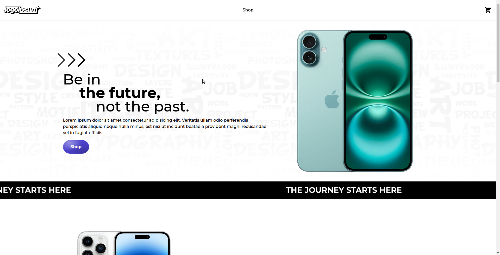
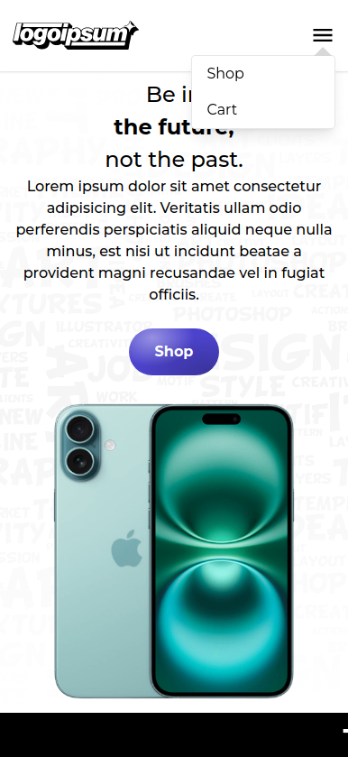
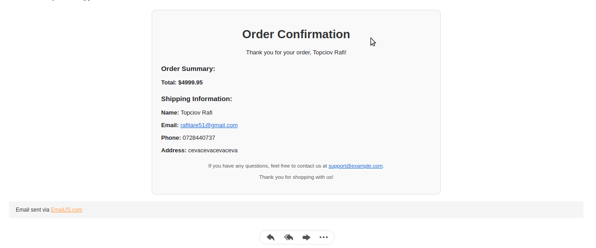

# Project: LogoIpsum shopping website!

[**Live version** of the site can be found here](https://shopping-cart-topciovrafaels-projects.vercel.app/)

This shopping website, LogoIpsum, showcases an intuitive e-commerce experience with a modern, responsive design. It allows users to browse, shop, and check out with ease. Here's an overview of the key features and design decisions that went into building the site:

### Features
**FakeStoreAPI for Products**

The products displayed on the website are fetched from the FakeStoreAPI. While the product catalog may not perfectly match the aesthetic of the homepage, this API was chosen for its ease of use and lack of API keys, ensuring the website remains functional without dependency on potentially expiring keys.

**Responsive Design**

The website is fully responsive, offering a seamless user experience across devices. A custom dropdown menu is included for navigating the shop and cart sections on mobile and smaller screens.

**Routing with React Router**

The site utilizes react-router-dom's Link component to enable smooth routing between pages, such as the homepage, shop, cart, and checkout.

**Checkout and Email Confirmation**

After filling out the checkout form, users receive a confirmation email detailing their order. This feature is powered by EmailJS, enabling direct email delivery without requiring a back-end server.

### Built With
Frontend Framework: Vite + React
Styling: HTML5, CSS, Tailwind CSS
APIs: FakeStoreAPI, EmailJS
Routing: react-router-dom

### Getting Started

In order to setup and work on this project on your own, you will need to:

1. Clone this project:  
   `git clone https://github.com/topciovrafael/shopping-cart.git`

2. Once you have cloned this project, you can install the required dependencies by using:  
   `npm install`

3. A live demo of the project can be started by using:  
   `npm run preview`

4. Distribution files can be produced using:  
   `npm run build`

### Display

The website on desktop viewport

The website on phone viewport

The confirmation mail

---

Developed by **Topciov Rafael**
